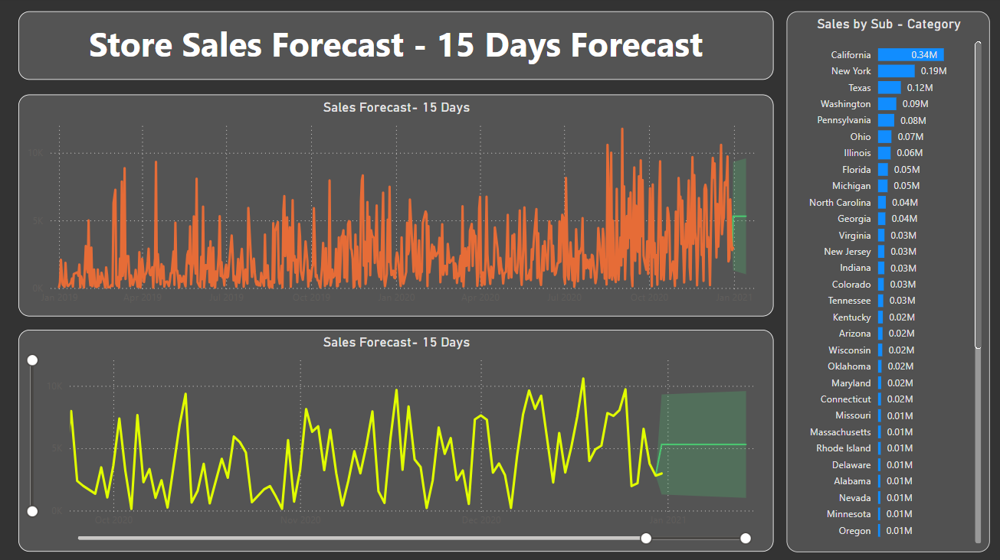

# Store Sales Data Analysis and Forecasting

This project demonstrates the analysis of store sales data, including forecasting and detailed visualization of sales metrics. The interactive dashboard provides insights into key performance indicators (KPIs), sales trends, and future projections, aiding in strategic decision-making.

---

## Features

### 1. **Store Sales Dashboard**
#### KPIs:
- **Total Sales:** $1.57M  
- **Total Quantity Sold:** 22K  
- **Total Profit:** $175.26K  
- **Average Delivery Time:** 4 days  
- **Number of States Covered:** 49  

#### Filters:
- Regional selection: Central, East, South, West.

#### Charts:
- **Sum of Sales by Segment:**
  - Distribution among Home Office, Consumer, and Corporate segments.
- **Monthly Sales and Profit Year-over-Year (YoY):**
  - Line charts comparing sales and profit trends for 2019 and 2020.
- **Sum of Sales by Payment Mode:**
  - Breakdown of sales by Cards, COD, and Online payment methods.
- **Sales by Ship Mode:**
  - Distribution across Standard, Second Class, First Class, and Same Day modes.
- **Sales by Category and Sub-Category:**
  - Performance metrics for categories like Office Supplies, Technology, and Furniture, along with sub-categories such as Phones, Chairs, and Binders.
- **Geographical Sales Distribution:**
  - Map visualization showing the sum of sales and profit by state.

#### Use Case:
Gain actionable insights into sales trends and performance across regions, categories, and customer segments.


---

### 2. **Store Sales Forecast (15 Days)**
#### Visuals:
1. **Top Graph:**  
   - Displays the sales forecast for the next 15 days using a time-series model.  
   - The orange line represents historical sales data, while the green area indicates forecasted values.
   
2. **Bottom Graph:**  
   - Provides another perspective of the sales forecast.  
   - The yellow line shows a smoothed trend with projected values represented in the green shaded area.

#### Use Case:
Predict sales to optimize inventory and resource allocation.



---

## Tools and Technologies
- **Power BI:**  
  Used for creating visuals, analyzing data, and building dashboards.  
- **Dataset:**  
  Includes metrics like sales amount, profit, product categories, shipping modes, payment methods, and regions.  
- **Forecasting:**  
  Time-series analysis for predicting sales using built-in Power BI forecasting tools.  

---

## How to Use
1. Clone the repository:  
   ```bash
   git clone https://github.com/aartiksaini/PowerBI_dashboard.git

---
## Insights Gained

1. **Forecast Accuracy:**  
   - Enabled accurate prediction of sales trends, aiding in better inventory management and resource allocation.
2. **Category Analysis:**  
   - Identified top-performing categories and sub-categories, such as Phones and Chairs, allowing for targeted marketing efforts.
3. **Geographical Trends:**  
   - State-wise sales distribution provided insights into regional performance and opportunities for expansion.
4. **Customer Segmentation:**  
   - Breakdown of customer segments by sales and payment methods helped in crafting tailored strategies for customer engagement.

---

## Future Improvements

1. **Dynamic Filtering:**  
   - Integrate more advanced filtering options, such as time-range selection or multi-layer filtering, for enhanced analysis flexibility.
2. **Enhanced Forecasting:**  
   - Incorporate external variables like holidays, promotions, and seasonality to further improve forecasting accuracy.
3. **Drill-Through Functionality:**  
   - Add drill-through capabilities to allow users to explore data at granular levels, such as specific regions or product lines.
4. **Real-Time Updates:**  
   - Enable real-time data integration for up-to-date analysis and decision-making.

---

## Contact

For questions, feedback, or collaboration opportunities, feel free to reach out:

- **Email:** sainiaartik8394@gmail.com  
- **GitHub:** [aartiksaini GitHub Profile](https://github.com/aartiksaini)

